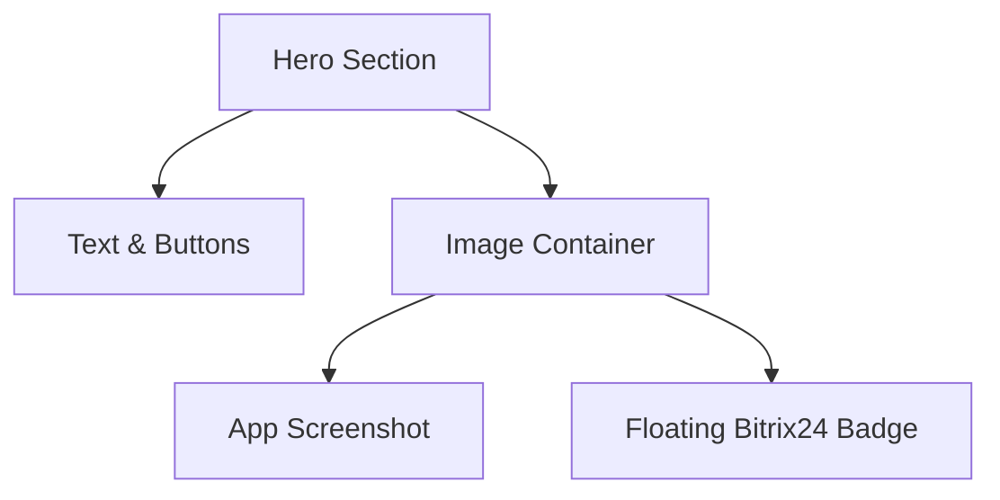

# Implementation Plan - CRM Integration in Hero Section

The goal is to add CRM integration information (specifically Bitrix24) to the first screen (Hero section) of the DoveChat landing page.

## Proposed Changes

### `siteitself/Dovechat_figma/src/app/components/Hero.tsx`
- Import `Layout` icon from `lucide-react`.
- Add a floating badge next to the main interface image to highlight CRM integration.
- The badge will feature the Bitrix24 logo (using a placeholder icon) and text.

## Visual Design
The badge will be positioned absolutely relative to the image container:
- **Background**: White with shadow.
- **Icon**: Blue (`#4A7FFF`) placeholder.
- **Text**: "Интеграция с Битрикс24".
- **Position**: Floating over or near the Hero image to indicate deep integration.

## Steps
1. Add `Layout` to imports.
2. Insert the badge JSX into the `relative` div containing the `ImageWithFallback`.
3. Apply Tailwind classes for positioning and styling.
